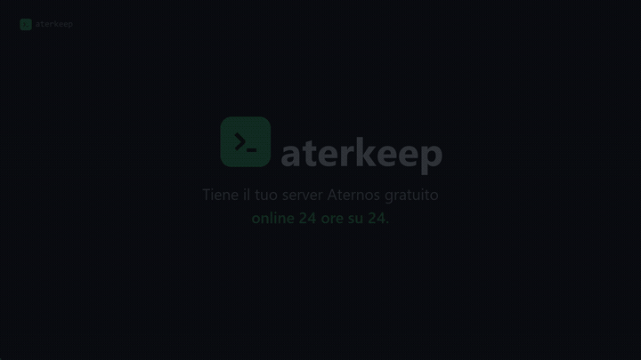

# aterkeep

<p align="center">
  
</p>

**Gestore server Aternos & dashboard 24/7.** Un singolo binario Rust (~1.7 MB) tiene online il tuo server Minecraft Aternos gratuito tutto il giorno e ti offre un pannello web moderno — niente automazione del browser, solo HTTP.

<p align="center">
  <a href="README.md">English</a> · <a href="README.tr.md">Türkçe</a> · <a href="README.de.md">Deutsch</a> · <a href="README.fr.md">Français</a> · <a href="README.es.md">Español</a>
</p>

---

<p align="center">
  <a href="promo/video/aterkeep-it.mp4"></a>
</p>

<p align="center">
  <sub><b>Guarda la panoramica di 30 secondi.</b> Clicca l'anteprima per l'MP4.<br/>
  Altre lingue: <a href="promo/video/aterkeep-en.mp4">English</a> · <a href="promo/video/aterkeep-tr.mp4">Türkçe</a> · <a href="promo/video/aterkeep-de.mp4">Deutsch</a> · <a href="promo/video/aterkeep-fr.mp4">Français</a> · <a href="promo/video/aterkeep-es.mp4">Español</a> · <a href="promo/video/aterkeep-pt.mp4">Português</a> · <a href="promo/video/aterkeep-ru.mp4">Русский</a> · <a href="promo/video/aterkeep-ar.mp4">العربية</a> · <a href="promo/video/aterkeep-zh.mp4">中文</a> · <a href="promo/video/aterkeep-ja.mp4">日本語</a> · <a href="promo/video/aterkeep-ko.mp4">한국어</a> · <a href="promo/video/aterkeep-nl.mp4">Nederlands</a> · <a href="promo/video/aterkeep-pl.mp4">Polski</a></sub>
</p>

---

## Funzionalità

- **Conferma automatica della coda** — quando arriva il tuo turno Aternos apre una finestra di circa 30 secondi; se nessuno risponde torni in fondo. È il passaggio che rende possibile il 24/7 senza sorveglianza.
- **Accede al posto tuo** — con il tuo account Aternos, aterkeep ottiene da solo il cookie di sessione e lo rinnova alla scadenza. Niente DevTools, niente copia-incolla mensile.
- **Bot anti-idle** — un client Minecraft che entra quando il server è acceso, così non viene spento perché vuoto
- **Ciclo keep-alive** — controlla ogni 90 s e riavvia il server automaticamente (disattivabile)
- **Dashboard web** — stato live, avvio/stop/riavvio, interruttore auto-start
- **Console server** — log del server in diretta dal browser
- **Editor impostazioni** — leggi/modifica `server.properties` dal pannello
- **Lista giocatori** — chi è online
- **Request inspector** — ogni chiamata HTTP con risposta JSON (didattico)
- **14 lingue** — interfaccia cambiabile nell'header
- **Sessione cifrata** — cookie in AES-256-GCM, la chiave non lascia mai la tua macchina

## Requisiti

- Windows 10/11 (usa `curl.exe` integrato)
- Toolchain Rust (solo per compilare)

## Installazione

```powershell
cd rust
cargo build --release
# binario: target/release/aterkeep.exe
```

## Installazione (una volta)

Avvia il binario e apri **http://127.0.0.1:4041**. La procedura guidata chiede
tre cose: lingua del pannello, password del pannello, sessione Aternos.

La **password del pannello** protegge il pannello *e* cifra la sessione. La
chiave **non viene mai scritta su disco**: è derivata dalla password a ogni avvio
(PBKDF2-HMAC-SHA256, 600 000 iterazioni). **Non c'è recupero.**

**Due modi per la sessione:**

**1. Account Aternos (predefinito).** Inserisci nome utente e password: aterkeep
accede via HTTP puro e ottiene il cookie da solo. Se l'account ha più server, la
procedura chiede quale tenere acceso. Le credenziali stanno in
`config/session.enc`, con la stessa cifratura AES-256-GCM dei cookie, e vengono
inviate solo ad `aternos.org`.

> Non funziona con l'**autenticazione a due fattori** né se Aternos richiede un
> **captcha**; entrambi vengono segnalati con un messaggio dedicato.

**2. Incollare i cookie (ripiego).** Su `aternos.org`: F12 → **Network** → F5,
copia l'intera riga `cookie:` di una richiesta ed esegui `window.AJAX_TOKEN`
nella **Console**. Una sessione creata così **non si rinnova da sola**.

## Avvio

```powershell
.\target\release\aterkeep.exe
```

Apri **http://127.0.0.1:4041**.

## Schede del pannello

| Scheda | Funzione |
|---|---|
| **Stato** | badge di stato, controlli, auto-start, log live, inspector |
| **Console** | flusso log server (aggiorna 10 s) |
| **Impostazioni** | modifica `server.properties` e salva |
| **Giocatori** | elenco giocatori online |

**Interruttore auto-start importante:** spento = il server non viene mai riavviato. **Stop** lo spegne automaticamente.

## Durata della sessione

Aternos rilascia il cookie con `Max-Age=2592000` — **esattamente 30 giorni**,
misurato dalla risposta di login, non ipotizzato.

**Con account:** niente da fare. Alla scadenza il daemon riaccede e prosegue —
una riga nel registro.

**Con cookie incollati:** il pannello mostra un badge `SESSION` e un avviso di
sessione scaduta — non un server spento — con un pulsante che riporta alla
procedura guidata.

Il pannello mostra anche l'**età della sessione** e, dopo la prima scadenza,
quanto è durata la precedente.

Avvio automatico dopo il riavvio: **[docs/AUTOSTART.md](docs/AUTOSTART.md)** (attività pianificata di Windows con DPAPI, systemd, Termux:Boot).

## Sicurezza

- Sessione cifrata a riposo (`session.enc`, AES-256-GCM)
- **Nessun file di chiave su disco** — la chiave è derivata dalla password (PBKDF2, 600 000 iterazioni, sale casuale per installazione). Copiare la cartella `config/` non serve a nulla senza la password
- **Il pannello richiede il login** — tutti gli endpoint dietro un cookie di sessione `HttpOnly`
- Stringhe API cifrate nel binario, decodificate a runtime con la tua chiave
- Pannello solo su `127.0.0.1`

## ⚠ Before you buy: Aternos' terms

Aternos' own support documentation says:

> *"Trying to bypass Aternos system by using bots, scripts, or other tricks to
> keep your server on 24/7 is against our rules… The system automatically
> checks for artificial activity."*
> — [24/7 Hosting](https://support.aternos.org/hc/en-us/articles/31771896948253-24-7-Hosting)

That describes this product. **Using aterkeep may get your server or your
Aternos account suspended or deleted.** There is no way for us to prevent that,
and the anti-idle bot makes the activity easier to spot, not harder.

This is sold as-is, for use on accounts you control and are willing to risk.
If that is not acceptable to you, do not buy it — a paid Minecraft host is the
supported way to run a server around the clock.

## Licenza

**aterkeep è software commerciale — non è open source.**

Il codice è pubblicato solo per trasparenza e valutazione. È consentito l'uso
personale e non commerciale. Ridistribuzione, rivendita, opere derivate e uso
commerciale **non** sono consentiti. Termini completi: [LICENSE](LICENSE).

## Acquistare una licenza

Uso commerciale, ridistribuzione, white-labelling e accesso al codice del motore
keep-alive (`aterkeep-core`) richiedono una licenza commerciale a pagamento.

**Contatto:** berlaylc2138@gmail.com

## Avvertenza

Progetto indipendente — non affiliato ad Aternos GmbH o Mojang Studios.
