# aterkeep

<p align="center">
  
</p>

**Gerenciador de servidor Aternos & painel 24/7.** Um único binário Rust (~1.7 MB) mantém seu servidor Minecraft Aternos gratuito online o dia inteiro e dá a você um painel web moderno — sem automação de navegador, HTTP puro.

<p align="center">
  <a href="README.md">English</a> · <a href="README.tr.md">Türkçe</a> · <a href="README.de.md">Deutsch</a> · <a href="README.fr.md">Français</a> · <a href="README.es.md">Español</a> · <a href="README.it.md">Italiano</a>
</p>

## Recursos

- **Confirmação automática da fila** — quando chega a tua vez, o Aternos abre uma janela de cerca de 30 segundos; sem resposta voltas para o fim. É este passo que torna o 24/7 sem supervisão possível.
- **Faz login por ti** — com a tua conta Aternos, o aterkeep obtém o cookie de sessão sozinho e renova-o quando expira. Sem DevTools, sem copiar e colar todos os meses.
- **Bot anti-idle** — um cliente Minecraft que entra quando o servidor está ligado para que não seja desligado por estar vazio
- **Loop keep-alive** — verifica a cada 90 s e reinicia o servidor automaticamente (desativável)
- **Painel web** — status ao vivo, iniciar/parar/reiniciar, interruptor auto-start
- **Console do servidor** — log ao vivo no navegador
- **Editor de configurações** — ler/alterar `server.properties` pelo painel
- **Lista de jogadores** — quem está online
- **Request inspector** — cada chamada HTTP com resposta JSON (educativo)
- **14 idiomas** — interface trocável no cabeçalho
- **Sessão criptografada** — cookies em AES-256-GCM, a chave nunca sai da sua máquina

## Requisitos

- Windows 10/11 (usa o `curl.exe` integrado)
- Toolchain Rust (só para compilar)

## Instalação

```powershell
cd rust
cargo build --release
# binário: target/release/aterkeep.exe
```

## Instalação (uma vez)

Executa o binário e abre **http://127.0.0.1:4041**. O assistente pede três
coisas: idioma do painel, palavra-passe do painel e sessão do Aternos.

A **palavra-passe do painel** protege o painel *e* cifra a sessão. A chave
**nunca é escrita em disco**: é derivada da palavra-passe a cada arranque
(PBKDF2-HMAC-SHA256, 600 000 iterações). **Não há recuperação.**

**Duas formas de dar a sessão:**

**1. Conta Aternos (padrão).** Escreve o teu utilizador e palavra-passe: o
aterkeep entra por HTTP puro e obtém o cookie sozinho. Se a conta tiver vários
servidores, o assistente pergunta qual manter ligado. As credenciais ficam em
`config/session.enc`, sob a mesma cifra AES-256-GCM dos cookies, e só são
enviadas para `aternos.org`.

> Não funciona com **verificação em duas etapas** nem se o Aternos pedir
> **captcha**; ambos são reportados com mensagem própria.

**2. Colar cookies (alternativa).** Em `aternos.org`: F12 → **Network** → F5,
copia toda a linha `cookie:` de um pedido e executa `window.AJAX_TOKEN` na
**Console**. Uma sessão criada assim **não se renova sozinha**.

## Executar

```powershell
.\target\release\aterkeep.exe
```

Abra **http://127.0.0.1:4041**.

## Abas do painel

| Aba | Função |
|---|---|
| **Status** | selo de status, controles, auto-start, log ao vivo, inspector |
| **Console** | fluxo de log do servidor (atualiza 10 s) |
| **Configurações** | editar `server.properties` e salvar |
| **Jogadores** | lista de jogadores online |

**Interruptor auto-start importante:** desligado = o servidor nunca reinicia. **Parar** o desliga automaticamente.

## Duração da sessão

O Aternos entrega o cookie com `Max-Age=2592000` — **exatamente 30 dias**,
medido na resposta do login, não adivinhado.

**Com conta:** nada a fazer. Ao expirar, o daemon volta a entrar e continua —
uma linha no registo.

**Com cookies colados:** o painel mostra um crachá `SESSION` e um aviso de sessão
expirada — não um servidor desligado — com um botão que leva ao assistente.

O painel mostra ainda a **idade da sessão** e, após a primeira expiração, quanto
durou a anterior.

Arranque automático após reiniciar: **[docs/AUTOSTART.md](docs/AUTOSTART.md)** (tarefa agendada do Windows com DPAPI, systemd, Termux:Boot).

## Segurança

- Sessão criptografada em repouso (`session.enc`, AES-256-GCM)
- **Nenhum arquivo de chave em disco** — a chave é derivada da senha (PBKDF2, 600 000 iterações, sal aleatório por instalação). Copiar a pasta `config/` não adianta sem a senha
- **O painel exige login** — todos os endpoints atrás de um cookie de sessão `HttpOnly`
- Strings da API criptografadas no binário, decodificadas em runtime com sua chave
- Painel apenas em `127.0.0.1`

## Licença

**aterkeep é software comercial — não é código aberto.**

O código é publicado apenas para transparência e avaliação. É permitido o uso
pessoal e não comercial. Redistribuição, revenda, obras derivadas e uso comercial
**não** são permitidos. Termos completos: [LICENSE](LICENSE).

## Comprar uma licença

Uso comercial, redistribuição, white-labelling e acesso ao código do motor
keep-alive (`aterkeep-core`) exigem uma licença comercial paga.

**Contato:** berlaylc2138@gmail.com

## Aviso

Projeto independente — sem afiliação com a Aternos GmbH ou a Mojang Studios.
