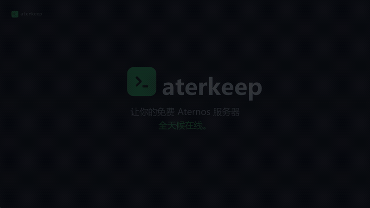

# aterkeep

<p align="center">
  
</p>

**Aternos 服务器管理与 24/7 看护面板。** 单个 Rust 二进制（约 1.7 MB）让您的免费 Aternos Minecraft 服务器全天在线，并提供现代 Web 面板——无需浏览器自动化，纯 HTTP。

<p align="center">
  <a href="README.md">English</a> · <a href="README.tr.md">Türkçe</a> · <a href="README.de.md">Deutsch</a> · <a href="README.fr.md">Français</a> · <a href="README.es.md">Español</a> · <a href="README.it.md">Italiano</a> · <a href="README.pt.md">Português</a> · <a href="README.ru.md">Русский</a>
</p>

---

<p align="center">
  <a href="promo/video/aterkeep-zh.mp4"></a>
</p>

<p align="center">
  <sub><b>观看 30 秒介绍.</b> 点击预览获取 MP4。<br/>
  其他语言: <a href="promo/video/aterkeep-en.mp4">English</a> · <a href="promo/video/aterkeep-tr.mp4">Türkçe</a> · <a href="promo/video/aterkeep-de.mp4">Deutsch</a> · <a href="promo/video/aterkeep-fr.mp4">Français</a> · <a href="promo/video/aterkeep-es.mp4">Español</a> · <a href="promo/video/aterkeep-it.mp4">Italiano</a> · <a href="promo/video/aterkeep-pt.mp4">Português</a> · <a href="promo/video/aterkeep-ru.mp4">Русский</a> · <a href="promo/video/aterkeep-ar.mp4">العربية</a> · <a href="promo/video/aterkeep-ja.mp4">日本語</a> · <a href="promo/video/aterkeep-ko.mp4">한국어</a> · <a href="promo/video/aterkeep-nl.mp4">Nederlands</a> · <a href="promo/video/aterkeep-pl.mp4">Polski</a></sub>
</p>

---

## 功能

- **自动确认排队** — 轮到你时 Aternos 会打开约 30 秒的确认窗口，无人响应就会被排到队尾。正是这一步让无人值守的 7×24 运行成为可能。
- **替你登录** — 用 Aternos 账号设置后，aterkeep 会自己获取会话 Cookie，并在过期时自动更新。不需要 DevTools，也不用每月复制粘贴。
- **防挂机机器人** — 服务器启动后自动加入的 Minecraft 客户端，避免因为没人而被关闭
- **Keep-alive 循环** — 每 90 秒检查，服务器离线时自动重启（可关闭）
- **Web 面板** — 实时状态、启动/停止/重启、自动启动开关
- **服务器控制台** — 浏览器中查看实时服务器日志
- **设置编辑器** — 从面板读取/修改 `server.properties`
- **玩家列表** — 谁在线
- **请求检查器** — 每个 HTTP 请求及其 JSON 响应（教学）
- **14 种语言** — 界面可在顶部切换
- **加密会话** — Cookie 使用 AES-256-GCM，密钥绝不离开您的电脑

## 环境要求

- Windows 10/11（使用内置 `curl.exe`）
- Rust 工具链（仅用于编译）

## 安装

```powershell
cd rust
cargo build --release
# 二进制：target/release/aterkeep.exe
```

## 安装（仅一次）

运行程序并打开 **http://127.0.0.1:4041**。向导会询问三件事：面板语言、面板
密码、Aternos 会话。

**面板密码**既保护面板，也用于加密会话。密钥**不会写入磁盘**，而是每次启动时
从密码派生（PBKDF2-HMAC-SHA256，600000 次迭代）。**无法找回。**

**提供会话有两种方式：**

**1. Aternos 账号（默认）。** 输入用户名和密码，aterkeep 通过纯 HTTP 登录并
自行获取 Cookie。若账号下有多台服务器，向导会询问要保持哪一台。凭据保存在
`config/session.enc` 中，与 Cookie 使用同一套 AES-256-GCM 加密，且只会发送到
`aternos.org`。

> 开启**两步验证**的账号无法使用，Aternos 要求 **captcha** 时同样如此；两种
> 情况都会给出专门的提示。

**2. 粘贴 Cookie（备用）。** 在 `aternos.org` 按 F12 → **Network** → F5，复制
任意请求的整行 `cookie:`，并在 **Console** 中执行 `window.AJAX_TOKEN`。这种
方式建立的会话**不会自动更新**。

## 运行

```powershell
.\target\release\aterkeep.exe
```

打开 **http://127.0.0.1:4041**。

## 面板标签页

| 标签页 | 功能 |
|---|---|
| **状态** | 状态徽章、控制按钮、自动启动、实时日志、请求检查器 |
| **控制台** | 服务器日志流（10 秒刷新） |
| **设置** | 编辑并保存 `server.properties` |
| **玩家** | 在线玩家列表 |

**自动启动开关很重要：** 关闭后服务器永远不会被重启。**停止**按钮会自动关闭它。

## 会话有效期

Aternos 下发 Cookie 时带有 `Max-Age=2592000` — **正好 30 天**。这是从登录响应
中实测的数字，不是猜测。

**用账号设置：** 无需操作。过期后守护进程会重新登录并继续运行，日志里只留一行。

**粘贴 Cookie 设置：** 面板会显示 `SESSION` 标记和会话过期提示，而不是让人以为
服务器停了，并提供一个直接回到向导的按钮。

面板还会显示**会话已运行时长**，第一次过期之后也会显示上一个会话坚持了多久。

重启后自动启动：**[docs/AUTOSTART.md](docs/AUTOSTART.md)**（受 DPAPI 保护的 Windows 计划任务、systemd、Termux:Boot）。

## 安全性

- 会话静态加密（`session.enc`，AES-256-GCM）
- **磁盘上没有密钥文件** — 密钥从密码派生（PBKDF2，600 000 次迭代，每次安装使用随机盐）。即使复制了 `config/` 目录，没有密码也无法解密
- **面板需要登录** — 所有接口均受 `HttpOnly` 会话 Cookie 保护
- API 字符串在二进制中加密，运行时用您的密钥解密
- 面板仅绑定 `127.0.0.1`

## ⚠ Before you buy: Aternos' terms

Aternos' own support documentation says:

> *"Trying to bypass Aternos system by using bots, scripts, or other tricks to
> keep your server on 24/7 is against our rules… The system automatically
> checks for artificial activity."*
> — [24/7 Hosting](https://support.aternos.org/hc/en-us/articles/31771896948253-24-7-Hosting)

That describes this product. **Using aterkeep may get your server or your
Aternos account suspended or deleted.** There is no way for us to prevent that,
and the anti-idle bot makes the activity easier to spot, not harder.

This is sold as-is, for use on accounts you control and are willing to risk.
If that is not acceptable to you, do not buy it — a paid Minecraft host is the
supported way to run a server around the clock.

## 许可证

**aterkeep 是商业软件 — 并非开源软件。**

公开源代码仅用于透明性与评估。允许个人非商业使用。**禁止**再分发、转售、衍生作品
及商业使用。完整条款见 [LICENSE](LICENSE)。

## 购买许可

商业使用、再分发、白标以及 keep-alive 引擎（`aterkeep-core`）的源码访问需购买
商业许可证。

**联系方式：** berlaylc2138@gmail.com

## 免责声明

独立项目 — 与 Aternos GmbH 或 Mojang Studios 无任何关联。
