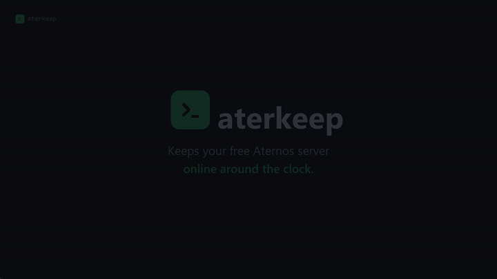

# Promo assets

Ready-to-post marketing material for aterkeep. Everything here is a finished
file — download it and use it. Nothing needs to be built.

| File | What it is |
|---|---|
| `video/aterkeep-<lang>.mp4` | **Product video, one per language** (14). 1920×1080, H.264, ~30s, ~350 KB. |
| `gif/aterkeep-<lang>.gif` | The same 30 seconds as an animated GIF (14). 720px, ~700 KB. For READMEs. |
| `logo.svg` | Brand mark, scalable, no text dependency. |
| `social.svg` | 1200×630 social / OG preview card. |

## The videos

Real `.mp4` files — post them to Discord, Twitter, YouTube, a store page,
anywhere that takes a video upload. They play everywhere: H.264 in `yuv420p`,
the profile every browser, phone and social platform accepts.

Seven scenes: the problem, the automatic queue confirmation (the thing a plain
keep-alive script cannot do), sign-in, the live panel, the feature set, and the
purchase call to action.

<p align="center">
  <a href="video/aterkeep-en.mp4"></a>
</p>

## The GIF previews

`gif/aterkeep-<lang>.gif` is the same 30 seconds as the MP4, 720px wide at
10 fps, ~700 KB each. They exist for one reason: **a GitHub README cannot play
a video file.** An animated GIF is the only thing that moves on the page.

That is worth stating plainly, because the obvious approaches all fail — each
of these was tried against GitHub's real README renderer:

| Attempt | What GitHub does |
|---|---|
| `<video src="...">` | **Tag deleted entirely.** Leaves an empty paragraph. |
| `` | Renders `` — a broken image. |
| `` | Proxied through camo, still a broken image. |
| Bare `.mp4` URL on its own line | Plain text link. |

Note the first row: GitHub's `/markdown` **API** keeps `<video>`, so testing
there tells you it works. The renderer that actually draws a repository README
does not. Test against `/repos/{owner}/{repo}/readme`, not `/markdown`.

Videos do play on GitHub when you drag one into an issue or PR comment — that
routes through GitHub's own attachment host. There is no supported way to
produce such a URL for a file committed to the repo, which is why the GIF
exists.

### Regenerating the GIFs

```bash
ffmpeg -i promo/video/aterkeep-en.mp4 \
  -vf "fps=10,scale=720:-1:flags=lanczos,split[a][b];[a]palettegen=max_colors=128[p];[b][p]paletteuse=dither=bayer:bayer_scale=3" \
  promo/gif/aterkeep-en.gif
```

The palette pass matters — without it the flat UI colours band badly and the
file gets *larger*, not smaller. Bayer dithering beats the default here because
the source is flat colour, not photography.

| | | | |
|---|---|---|---|
| [English](video/aterkeep-en.mp4) | [Türkçe](video/aterkeep-tr.mp4) | [Deutsch](video/aterkeep-de.mp4) | [Français](video/aterkeep-fr.mp4) |
| [Español](video/aterkeep-es.mp4) | [Italiano](video/aterkeep-it.mp4) | [Português](video/aterkeep-pt.mp4) | [Русский](video/aterkeep-ru.mp4) |
| [العربية](video/aterkeep-ar.mp4) | [中文](video/aterkeep-zh.mp4) | [日本語](video/aterkeep-ja.mp4) | [한국어](video/aterkeep-ko.mp4) |
| [Nederlands](video/aterkeep-nl.mp4) | [Polski](video/aterkeep-pl.mp4) | | |

## Rendering the SVGs to PNG

Some platforms want a raster image:

```bash
rsvg-convert promo/social.svg -o social.png
rsvg-convert -w 512 -h 512 promo/logo.svg -o logo-512.png
# or open the SVG in a browser and screenshot it
```

## Please keep these

The final scene of every video carries the licence line, the no-affiliation
line and the Aternos-terms warning. Those belong in outward-facing material,
not only in the README — anyone who sees the video should know the risk before
they buy. Don't cut the ending when you re-post.
